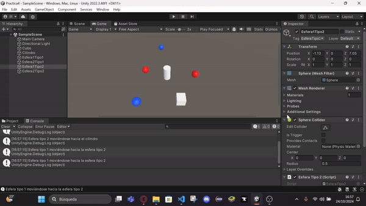
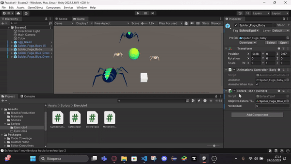
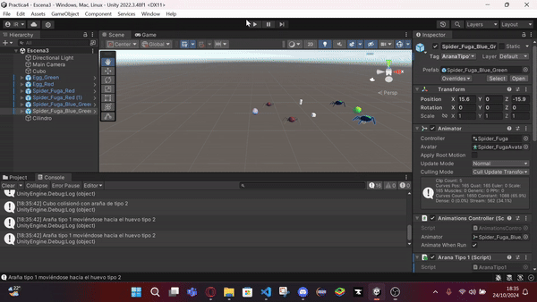
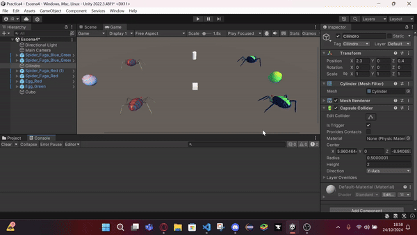
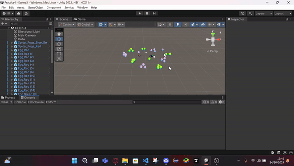
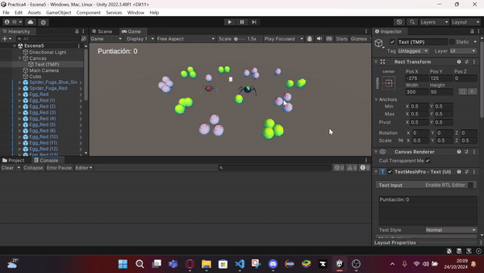
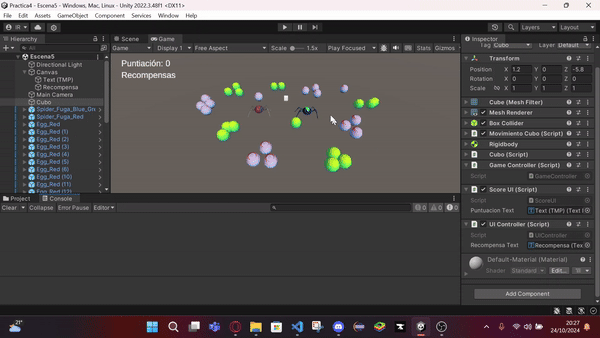

# Practica_Delegados_Eventos - Ejercicios Práctica 4

Este repositorio contiene la implementación de varios ejercicios relacionados con la creación de una mecánica de juego en Unity. A continuación se detallan los ejercicios realizados.

## Ejercicio 1: Mecánica de Colisión

**Descripción:**
- Cuando el cubo colisiona con el cilindro, las esferas de tipo 1 se dirigen hacia una de las esferas de tipo 2 fijadas de antemano, y las esferas de tipo 2 se desplazan hacia el cilindro.

**Implementación:**
- Se utilizó el evento `OnCollider` u `OnTrigger` para gestionar las colisiones.
- Se envían mensajes desde el cilindro, y las esferas están suscritas a esos mensajes, implementando funciones de callback correspondientes.

---

## Ejercicio 2: Sustitución de Objetos Geométricos

**Descripción:**
- Sustituir los objetos geométricos (esferas y cilindro) por modelos de arañas y huevos.

**Implementación:**
- Se utilizaron modelos de arañas para las esferas y huevos para el cilindro.

---

## Ejercicio 3: Arañas de Diferentes Tipos y Huevos

**Descripción:**
- Adaptar la escena para incluir arañas de tipo 1 y tipo 2, así como diferentes tipos de huevos (tipo 1 y tipo 2).
- Las arañas de tipo 1 deben acercarse a un objeto seleccionado cuando el cubo colisiona con una araña de tipo 2.
- Las arañas de tipo 2 deben moverse hacia un objetivo al que se asignará un huevo.

**Implementación:**
- Se gestionan las colisiones para que si una araña colisiona con un huevo, cambie de color.

---

## Ejercicio 4: Teletransportar Arañas

**Descripción:**
- Cuando el cubo se aproxima al objeto de referencia, las arañas del grupo 1 se teletransportan a un huevo objetivo fijo.
- Las arañas del grupo 2 se orientan hacia un objeto en la escena.

---

## Ejercicio 5: Recolección de Huevos y Puntuación

**Descripción:**
- Implementar la mecánica de recolección de huevos que actualizan la puntuación del jugador.
- Las arañas de tipo 1 suman 5 puntos y las de tipo 2 suman 10 puntos.
- Mostrar la puntuación en la consola.

**Implementación:**
- Se gestionan las colisiones utilizando los métodos `OnTriggerEnter` y `OnCollisionEnter` para detectar con quién ha chocado el cubo.

---

## Ejercicio 6: Interfaz de Usuario (UI)

**Descripción:**
- Crear una interfaz que muestre la puntuación acumulada por el cubo.

**Implementación:**
- Se creó un objeto `Canvas` para la UI y se incorporó un componente de texto (TextMeshPro) que se actualiza al sumar puntos.

---

## Ejercicio 7: Recompensas por Puntuación

**Descripción:**
- Implementar una mecánica en la que cada 100 puntos, el jugador obtiene una recompensa que se muestra en la UI.

**Implementación:**
- Se añadió lógica en el controlador de juego para verificar cuando el puntaje alcanza un múltiplo de 100 y se actualiza la UI en consecuencia.

---

### Ejercicio 8:
Generar una escena que incluya elementos del prototipo:
- Arañas de dos tipos (Grupo 1 y Grupo 2).
- Huevos de dos tipos (Tipo 1 y Tipo 2).
- Interacciones entre el cubo y las arañas (moverse hacia huevos u objetos) y la puntuación.

Esto ya está desarrollado en los **ejercicios 1-4**, donde creaste escenas con todos estos elementos, y en los **ejercicios 5-6**, donde implementaste la mecánica de puntuación y movimientos de las arañas hacia objetivos.

---

### Ejercicio 9:
Implementar el **Ejercicio 3** con el cubo como un objeto físico (`Rigidbody` no cinemático):
- Este ejercicio simplemente cambia el comportamiento del cubo para hacerlo un objeto físico. La mecánica de interacción (detectar colisiones con las arañas y huevos, sumar puntos, mover las arañas) ya fue implementada en los ejercicios previos, en particular en los **ejercicios 3-7**.

---